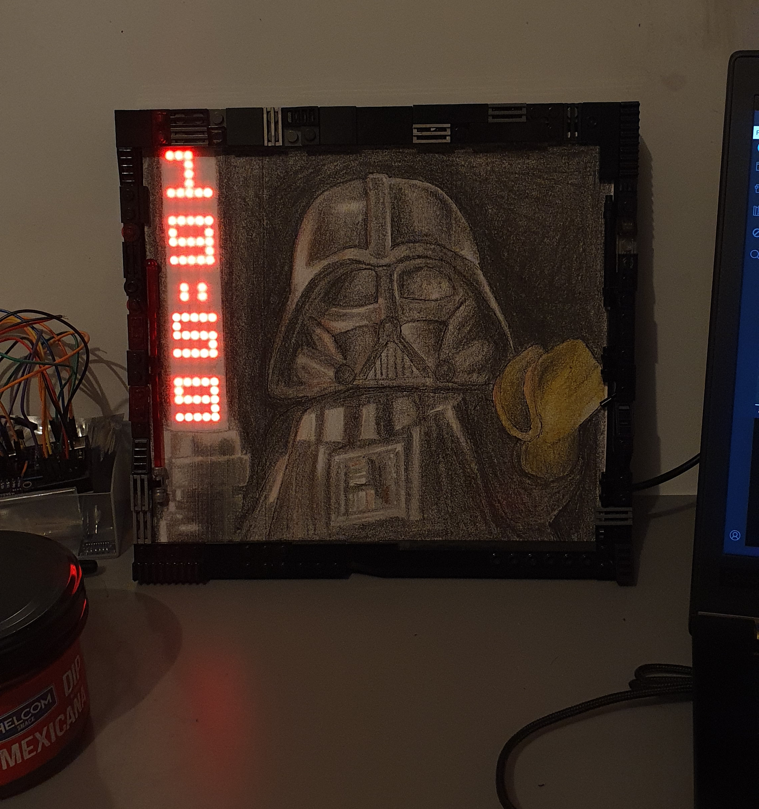
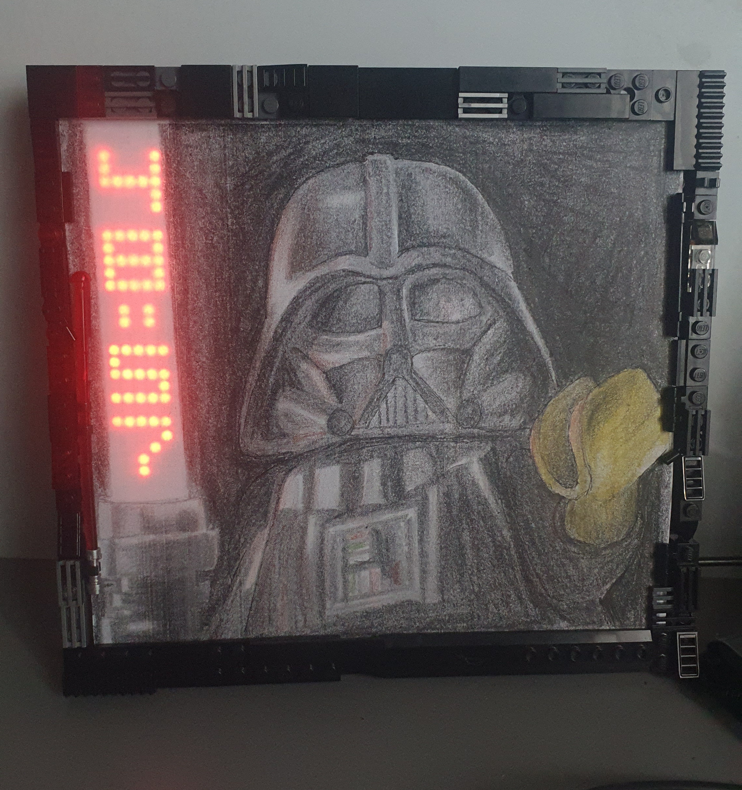
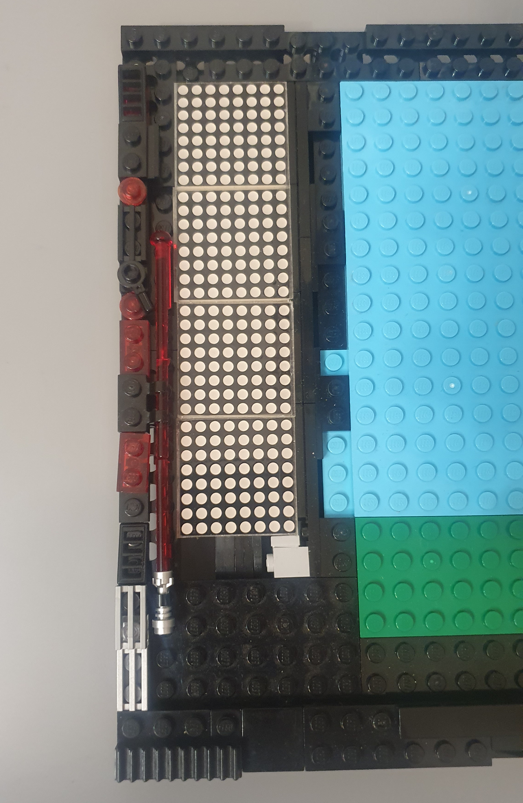
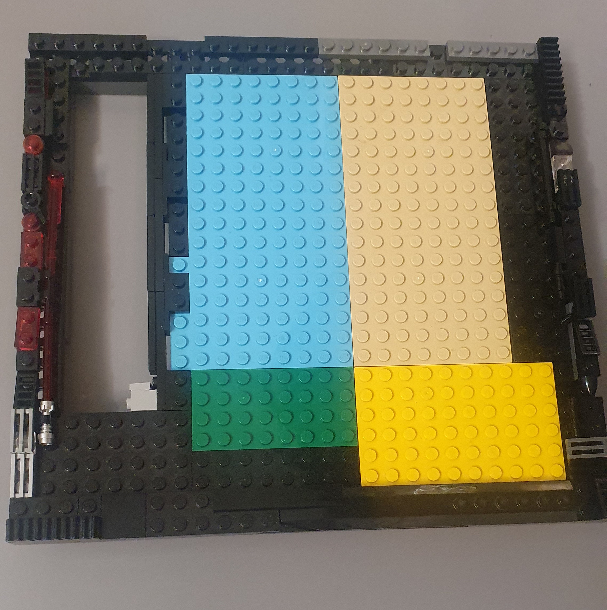

# LEDo-Force




## About The Project

4-module MAX7219 LED matrix as a lightsaber for lego darth vader. It can show pomodoro timer, lightsaber or clock(todo).

yt video: https://www.youtube.com/watch?v=gJfaWJKogRg

**Key Features:**

* **Pomodoro Timer:** A timer set to 50-minute work sessions and 10-minute break sessions. You can change it in code.
* **Lightsaber Mode:** An LED matrix animation, random intensity changes to the LEDs
* **Clock Mode:** A placeholder state for future development, when I will get ds3231 clock module

## Hardware Requirements

To build this project, you need the following components:

* 1x Arduino board (in my case - Arduino Pro Micro)
* 1x MAX7219 8x8 LED Matrix module (4-in-1, FC16_HW hardware type)
* Jumper wires
* ds3231 clock module (todo)

**Wiring Diagram**

The MD_MAX72XX library uses Hardware SPI by default. The CS (Chip Select) pin is defined as 10 in the code.

| MAX7219 Pin | Arduino Pin |
| --- | --- |
| VCC | 5V |
| GND | GND |
| DIN | Pin 11 (MOSI) |
| CS | Pin 10 |
| CLK | Pin 13 (SCK) |

## Software & Libraries

This project is developed using the **Arduino IDE**.

You need to install the following library:

- **MD_MAX72XX** (Handles the matrix drawing and hardware interface)


## Setup and Configuration

1. Open the `.ino` file in the Arduino IDE.
2. Ensure the `MD_MAX72XX` library is installed.
3. Choose the operating mode by modifying the `actualState` variable at the top of the code:
```cpp
const States actualState = POMODORO; 
```
*(Available states: POMODORO, CLOCK, LIGHTSABER)*


4. If necessary, adjust the LED brightness by changing the value of `#define LED_INTENSITY 4`.
5. Upload the code to your Arduino board.




## Frame



## Helful tutorials:

for making led matrix:
- https://xantorohara.github.io/led-matrix-editor/#001f1111111f0000|0011111f10100000|001d151515170000|00151515151f0000|00070404041f0000|00171515151d0000|001f1515151d0000|0001011905030000|001f1515151f0000|00171515151f0000
- 

for DS3231 clock module
- https://lastminuteengineers.com/ds3231-rtc-arduino-tutorial/
